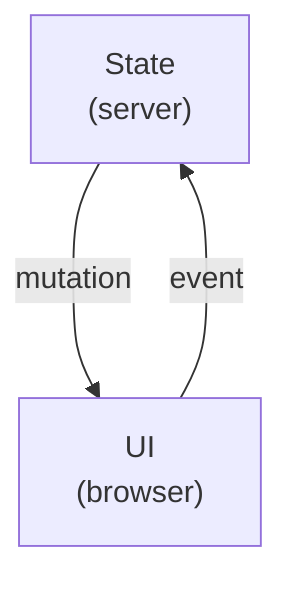

# HTTP/X (RFC)

HTTP/X is a protocol for webapps that enables state and logic to operate server-side instead of in the browser.

The X is meant to represent the marriage of two concepts: bidirectional communication + a predefined instruction set designed for efficient manipulation of the DOM from over the wire.

Think of it like HTTP but in reverse.  Instead of the browser driving the communication, HTTP/X puts the server in the driver’s seat.

### Table of Contents
- [Advantages](#advantages)
- [Why a Spec?](#why-a-spec)
- [Terminology](#terminology)
- [Bidirectional Protocols](#bidirectional-protocols)
- [Lifecycle](#lifecycle)
- [Graceful Fallback to HTTP](#graceful-fallback-to-http)
- [Sentinels](#sentinels)
- [Mutation Instruction Set](#mutation-instruction-set)
- [Layout Reuse](#layout-reuse)
- [Known Implementations](#known-implementations)

## Advantages

HTTP/X brings 4 main benefits:
1. **New Languages**<br />
When both browser events and DOM manipulations can be operated server-side, it fully removes your codebase’s dependency on JavaScript to drive the micro-interactions necessary in any modern webapp. This frees developers to choose languages based on their merits, not the browsers’ limitations.  (To enhance your language of choice, check out [ZeroScript](https://zeroscript.org), syntactic sugar for easily templating HTML in any language.)
2. **No API Needed**<br />
Since the business logic is never downloaded to the browser, there’s no need to fetch data from a separate API thus eliminating an additional resource to build and manage.
3. **Zero Payload Issues**<br />
The amount of JavaScript needed to run HTTP/X is not only shockingly tiny, it stays the exact same size, even if the complexity of your webapp grew to hundreds of megabytes (as native apps often do).  This lifts the burden of toiling over optimizations like code splitting, etc and eliminates needing to compromise delightful UX in the name of lighthouse scores.
4. **Globally Shared State**<br />
When state must be sent to each individual browser so the UI can react to its changes, there will inevitably be a drift in consistency and is (by default) limited to a user’s own local actions.  When the state lives server-side, reacting to changes made by any source, regardless of who or what initiated it, is trivial to support as it’s the default programming model.

## Why a Spec?

This is NOT intended to be implemented by browsers or engines nor is it a proposal for the HTTP spec itself.  The reason it’s not just a simple library is because it’s meant to be implemented across a number of languages.  Having a consistent implementation across languages [reduces framework fatigue](https://rylan.io/zero-new-syntax-to-learn/) and makes learned skills transferable from language to language.

## Terminology

- **Connection** - A connection refers to a single WebSocket connection (or other similar protocol’s version of a connection).  Specifically it correlates to a single browser tab or single browser window and isn’t shared across multiple instances.
- **Session** - A session is cookie-based and is shared across multiple tabs/windows of the same web browser.  This is not the case for users that run multiple browser vendors at the same time.  A user might authenticate into the same account across multiple browser vendors, but while they may share the same account, they do NOT share the same session.  Authentication is an application concern and is outside the scope of HTTP/X.
- **DOM mutation** - Any change to the browser’s Document Object Model is considered a DOM mutation.  Primarily this is done by setting an element’s nodeValue for the sake of precision and performance but technically also includes HTML partials.
- **HTML partial** - This is a specific type of DOM mutation but instead of changing properties on single elements at a time, it replaces a larger tree of elements by brute force using outerHTML.

## Bidirectional Protocols

Unlike most other web frameworks where the use of bidirectional protocols is optional or “nice-to-have”, HTTP/X takes a hard dependency on it.  HTTP/X primarily uses WebSockets but should fall back to other similar protocols if necessary such as:

- [WebSockets](https://en.wikipedia.org/wiki/WebSocket)
- [Server Sent Events](https://en.wikipedia.org/wiki/Server-sent_events)
- [Forever Frame](https://en.wikipedia.org/wiki/Comet_(programming))
- [Ajax long polling](https://en.wikipedia.org/wiki/Comet_(programming))

The fallback order is not crucial nor is supporting every protocol.  Most language ecosystems already have [libraries](https://developer.mozilla.org/en-US/docs/Web/API/WebSockets_API#tools) that handle this level of transport transparently and their use is greatly encouraged.

## Lifecycle



HTTP/X leverages [unidirectional data flow](https://developer.android.com/jetpack/compose/architecture#udf), a familiar pattern where state flows down and events flow up which enables decoupling views that display state in the UI from the parts of the app that store and change state.  This fits very naturally in a web context since browsers use objects to encapsulate their events making them trivial to marshall across the wire to server-side event handlers.  The typical lifecycle goes as follows:

1. The browser performs a GET request.
2. Server responds with a 200 status code and regular, old fashioned HTML.  Some elements in this HTML might be appended with [sentinels](#sentinels) for precision-manipulation of mutable elements.
3. The browser displays HTML and establishes a [bidirectional channel](#bidirectional-protocols) with the server ([usually a WebSocket](#bidirectional-protocols)).
4. Any event listeners created are operated by serializing the event into JSON, MessagePack (or other) and sending to the server over its bidirectional connection.
5. The server is not obligated to respond to these events in any way.  Since this is an always-on, bidirectional channel, the server can push DOM mutations at any time.  Any changes to the UI state that result in DOM mutations will trigger mutation instructions to be pushed to the browser.  While this does frequently occur due to state-changes made by server-side event handlers, this can just as easily occur due to external sources like realtime database listeners or interactions from other users mutating “shared state.”
6. Subsequent GETs cause the connection to be closed and the whole process starts over again EXCEPT in cases where the layout has been configured for reuse.  This technique prevents GETs from navigating away from the current page thus reusing the connection.  Executing the route handler then causes the server to set its desired state changes for that route thus triggering more mutation instructions to be pushed to the browser.

## Graceful Fallback to HTTP

HTTP/X requires a bidirectional channel like WebSockets, SSE or long-polling in order to operate fully.  

In the event where a bidirectional channel cannot be established, HTTP/X must resort to a request/response protocol by POSTing browser events to the server and awaiting for DOM mutations in the response.  This means that the server cannot react to state changes unless it occurred as a part of the event handler or initial GET of that specific tab/window.  This HTTP-only mode should be a rare occurrence and can be disabled for webapps where this service degradation is not suitable.

One use case that is not rare, however, is robot traffic.  HTTP/X must be able to decipher between legitimate traffic and robot traffic.  This could be from search engines, unfurling services, or even curl.  

In these use cases, there is no opportunity to establish a bidirectional channel for “follow up DOM mutations.”  This means it’s not possible to first send a non-blocking response to the initial GET and follow up with DOM mutations once async data becomes available.  Instead, in HTTP-only mode the initial GET must wait until all the data needed for rendering a full HTML page is collected before writing to the network stream.  This also means that any data listeners connected to any realtime data sources must know not to listen for changes and instead fetch just once for that connection.

## Sentinels

HTTP/X is NOT a protocol from swapping HTML partials.  While that is possible, HTTP/X is primarily focused on replacing individual nodeValues.  The goal is to provide the maximum level of performance and precision.

The server needs an efficient way to target changes to specific elements in a sea of DOM nodes.  Sentinels are applied transparently so the application developer isn’t forced to use id="..." repeatedly or in ways that are incompatible with styling or repetitive components.  A sentinel is a tiny <script> block that references its prior sibling and saves it in a variable in the DOM’s global space.  

Important!
Sentinels are not needed for every node – only the ones that can change.

Here’s a simplistic example (excluding a few edge cases):

```html
<script>
    function register(id) {
        this[id] = document.currentScript.previousSibling;
    }
</script>
```


Register a tag:

```html
<p>This is a paragraph.</p><script>register(“slot0”)</script>
```

Register text:
To target a substring of text inside a larger text node, you must isolate it with a “blank” node so that its nodeValue can be updated in isolation to the full body of text.

```html
<p>Greetings <!-- -->human<script>register(“slot1”)</script>, and welcome!</p>
```

Register an attribute:

```html
<input type=”text” value=”” /><script>register(“slot2”, “value”)</script>
```

> [!Note]
> While HTTP/X is made to work seamlessly with [ZeroScript](https://zeroscript.org), it is possible to retrofit the protocol into other preexisting templating engines.

## Mutation Instruction Set

The instruction set needed for mutating the DOM from the server-side is small – only 3 instructions.  Here are the formats the server responds with which directly targets functions already in the DOM.

- Element values
```json
{ "id": "slot0", "value": "anything" }
```

- Element attributes
```json
{ "id": "slot1", "attribute": "anything" }
```

- HTML partials
```json
{ "id": "slot2", "html": "<p>any <b>HTML</b> string<p>" }
```

## Layout Reuse

HTTP/X includes a unique way to reuse documents of the same layout between multiple GET requests without needing to rebuild the entire DOM.  Granted, a browser’s initial GET request to any URL must return regular, old fashioned, vanilla HTML with a 200 HTTP status code.  But once it establishes a bidirectional transport for communication, all subsequent GET requests to a route using the same shared layout can take a different approach.

To accomplish this, the server must respond with a 204 - No Content status code.  This indicates that the browser should not replace the current page with a new page.  The server can then alter the UI state held in its memory, which may or may not trigger DOM mutations to be pushed to the browser over the bidirectional channel.

For example, imagine starting by visiting example.com/posts which would return basic HTML with a 200 status code, and establish a bidirectional channel with the server.  If the user then clicked on example.com/posts/featured, the server would know, since it already has a dedicated connection established for this request and that it needs to transition between two states of the same layout, it could respond with a 204 No Content, and then adjust its UI state such that only the featured posts are being shown.  

This has the nice side effect of treating URLs like “bookmarks for state” instead of “pointers to documents.”

Please note that proper UX might dictate that in some cases, while a layout CAN be shared, sometimes it shouldn’t.  An example of this is lateral moves to the same routes of different IDs, like from example.com/products/1 to example.com/products/2. The user might be scrolled way down into the related products section and click on product/2.  In this use case, the layout shouldn’t be reused, nor does scrolling to the top fix the expected behavior.  Most mature design systems would dictate that these layouts be transitioned using either a [lateral or forward-and-backward](https://m3.material.io/styles/motion/transitions/transition-patterns) approach.

The specifics of this configuration is outside the scope of HTTP/X; it’s an implementation detail for the application framework.

## Known Implementations

Below is a running list of known guest languages.

| Language | Project |
|---|---|
| C# | [github.com/xui/xero](https://github.com/xui/xero) |
